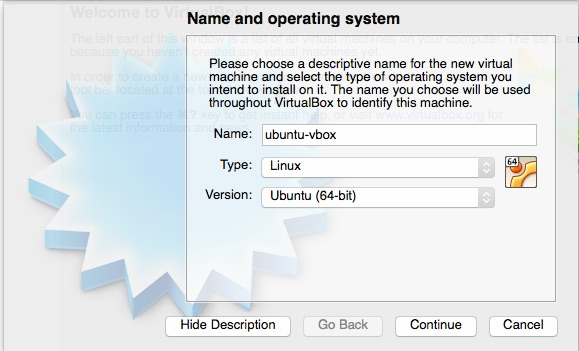
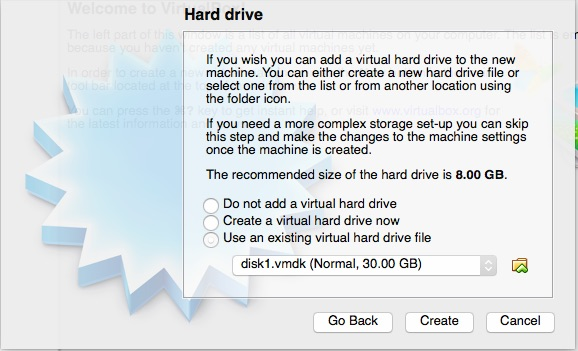

## What is a Vagrant Box, and who is "vagrant"?

A Vagrant box is a tar ball/zip package of the contents of a VM with a
metadata.json file. See http://docs.vagrantup.com/v2/boxes/base.html
and http://docs.vagrantup.com/v2/boxes/format.html.

The special part of how Vagrant boxes work is the "vagrant"
user. Every Vagrant box has to have such a user, with sudo privileges,
as that is the account used to connect via ssh and drive the automated
provisioning process defined in the Vagrantfile.

In Linux that is quite straightforward, including the addition of the
[insecure keypair](https://github.com/mitchellh/vagrant/tree/master/keys),
the default "vagrant" password and the password-less sudo. In
addition, setting the UUID to a number less than 1000 (900 for these
VMs) also hides the vagrant user on the login screen, see
http://ubuntuforums.org/showthread.php?t=1344414 and the
[vagrant_user_settings.sh script](utils/vagrant_user_settings.sh).

So, creating a Vagrant box is a simple process of:

1. Obtaining a suitable ISO.
2. Create a VM from that ISO.
3. Remove unwanted software, e.g. see the [uninstall_office.sh script](utils/uninstall_office.sh)
4. Add the vagrant user to the VM.
5. Package the box.

The scripts in the "utils" directory help with that. The base Ubuntu VM
boxes for VMWare and VirtualBox are here:

https://atlas.hashicorp.com/matuteana/boxes

## Why Different Providers?

The main motivation is that each VM flavour has different helper
utilities. VBox Guest additions  in the the case of VirtualBox, and
VMWare tools in the case of VMware. These helper utilities have to
updated and managed in different ways to make the VMs usable.

The Ubuntu base VM was created with VMware initially and when fully
tested, a VirtualBox version was created. The VMware Fusion VM are
more "usable" in a variety of different ways.

## Creating a VBox VM from a VMware VM

The concept is simple, in that you create a VBox VM of the given
target type, i.e. Ubuntu, *without* a disk, and then you clone the
disk from the VMware VM to use with the VBox VM. Then you uninstall
vmware tools and install the VBox helper. This is explained in detail
below.

I used this tutorial as a guide: http://www.dedoimedo.com/computers/virtualbox-clone.html

1. Create the VBox VM

Create a new VM as illustrated below. There is nothing new or
different at this step.



Press "Continue", and a directory will be created for the new VM,
which you will use in the next step. Choose the default memory size of
512MB (the RAM for the final VM is defined in the Vagrantfile) and press "Continue".

2. Clone the HD from the VMware Fusion VM

``` bash
$VBoxManage clonehd ~/Documents/Virtual\ Machines/Ubuntu-14.04LTS-Vagrant-VMware.vmwarevm/Virtual\ Disk-cl1.vmdk ~/VirtualBox\ VMs/ubuntu-vbox/disk1.vmdk
0%...10%...20%...30%...40%...50%...60%...70%...80%...90%...100%
Clone hard disk created in format 'VMDK'. UUID: 135dda03-1934-47eb-8d9b-2dc33849917f
```
3. Choose the Cloned Disk for the New VM

Rather than create a new disk for the new VM, choose the disk
just cloned from the VMware Fusion VM.



Then press "Create".

4. Remove VMware Tools and Install VBox Guest Additions

Start the VBox VM and log in as "vagrant/vagrant".

Bring up a terminal, then do the following.

```bash
$ cd vmware-tools-distrib/bin
$ sudo ./vmware-uninstall-tools.pl
$ cd
$ sudo rm -rf vmware-tools-distrib/bin
```
Then insert the Guest Additions CD via the Devices Menu and select
"Run" when the dialog appears. Then shutdown the VM.

## Packaging Boxes

Packaging boxes varies depending on the provider.

### VirtualBox

The simple case is the VBox (virtualbox) provider, as that is the
Vagrant default and so built into the Vagrant framework. Given the VBox VM
created above, you would use the commands below on OS X:

```bash
$ cd ~/Downloads
$ vagrant package --base ubuntu-vbox --output ubuntu-vbox.box
==> ubuntu-vbox: Exporting VM...
==> ubuntu-vbox: Compressing package to: /Users/ana/Downloads/ubuntu-vbox.box

```

Having created the box package, you should see something like:

```bash
$ ls -la ubuntu-vbox.box 
-rw-r--r--  1 ana  staff  1617773875 15 Aug 18:27 ubuntu-vbox.box
```

Then you can add the box locally for testing like this (note the
--force that causes any existing VM to be overwritten so that you to do this as often as you need to):

```bash
$ vagrant box add --force --name ubuntu-vbox ubuntu-vbox.box 
==> box: Adding box 'ubuntu-vbox' (v0) for provider: 
    box: Downloading: file:///Users/ana/Downloads/ubuntu-vbox.box
==> box: Successfully added box 'ubuntu-vbox' (v0) for 'virtualbox'!
```
To then use the local box, given a suitable [Vagrantfile](vagrant_files/Vagrantfile), you do this:

```bash
$ vagrant up --provider virtualbox
Bringing machine 'default' up with 'virtualbox' provider...
==> default: Importing base box 'ubuntu-vbox'...
```

### VMware

The [vmware provider(s)](http://www.vagrantup.com/vmware) have to be
[purchased](http://www.vagrantup.com/vmware#buy-now) before you can
use them.

The packaging process for VMware based boxes is entirely manual. The
steps here are derived from these [instructions](http://docs.vagrantup.com/v2/vmware/boxes.html).

The files that are strictly required for a VMware machine to function
are: nvram, vmsd, vmx, vmxf, and vmdk files, as well as a metadata.json file with these contents:

```python
{
  "provider": "vmware_desktop"
}
```
Then you can use the steps provided in the [package_vmware.sh script](utils/package_vmware.sh).

To then use the local box, given a suitable
[Vagrantfile](vagrant_files/Vagrantfile), you do this:

```bash
$ vagrant up --provider=vmware_fusion
```

## Adding Boxes to Atlas

The base Ubuntu VMs are available at: https://atlas.hashicorp.com/matuteana

In order to get those boxes there, you have to add boxes via the [web
UI](https://atlas.hashicorp.com/boxes/new).

Note that uploading a box does not release it, so you need to make
sure that you explicitly releases the box, via "Edit" and "Release version".

To test whether that has worked, you need to delete the local copy of
the boxes that you have created so that the box will be downloaded as
it won't be found locally, like this (this will, not
incidentally, save a lot of disk space also):

```bash
$ cd ~/.vagrant.d/boxes/
$ ls
matuteana-VAGRANTSLASH-ubuntu-vbox
ubuntu-vbox
matuteana-VAGRANTSLASH-ubuntu-vmware
ubuntu-vmware
$ rm -rf *
```

The filenames with `matuteana-VAGRANTSLASH-` are the boxes from Atlas,
those without are local boxes.

Then see the [details of how to up the boxes](upping_the_boxes.md).
