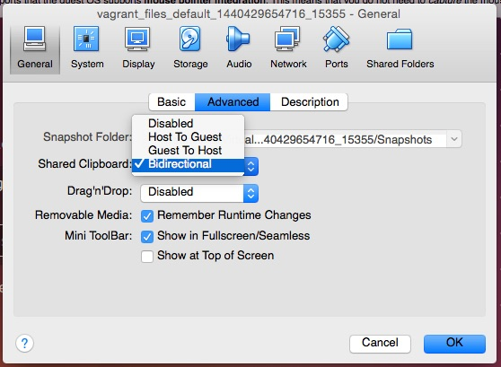

# Things That Go Wrong

Vagrant is really useful, but not perfect, and sometimes
fails. This is a collection of failures witnessed and what was done to
fix the problem.

## VirtualBox - A host only network interface you're attempting to configure via DHCP

"A host only network interface you're attempting to configure via DHCP
already has a conflicting host only adapter with DHCP enabled. The
DHCP on this adapter is incompatible with the DHCP settings. Two
host only network interfaces are not allowed to overlap, and each
host only network interface can have only one DHCP server. Please
reconfigure your host only network or remove the virtual machine
using the other host only network."

The resolution is described here:

https://github.com/mitchellh/vagrant/issues/3083

`VBoxManage dhcpserver remove --netname HostInterfaceNetworking-vboxnet0`

##  The box you attempted to add doesn't match the provider you specified

This happens, it appears, when the metadata.json *in*  the manually created VMware
box bundle defines specific providers for VMware,
e.g. `vmware_fusion` and/or `vmware_workstation`. This is a  glitch in Vagrant that ought to be fixed, but clearly is
not that important yet.

See this post for an example of the issue:

https://groups.google.com/forum/#!topic/vagrant-up/qhmw5SUdaic


```bash
$ vagrant up --provider=vmware_fusion
...
The box you attempted to add doesn't match the provider you
specified

Provider expected: vmware_desktop
Provider of box: vmware_fusion
```

What makes this especially confusing is that a box added locally works
as expected with the provider of `vmware_fusion` in the
metadata.json. However, when you add the box to atlas with an internal
provider of `vmware_fusion`, and an Atlas provider of
`vmware_desktop` (which is the only available `vmware` provider in
Atlas), and then attempts to up it from Atlas, you see the message above.

In the process of trying different permutations and combintations
here, it was discovered that *removing* the
`vmware_desktop` provider for the box in Atlas resulted in this error:

```bash
$ vagrant up --provider=vmware_fusion
...
An error occurred while downloading the remote file. The error
message, if any, is reproduced below. Please fix this error and try
again.

The requested URL returned error: 404 Not Found
```

The combination that appears to work for both locally added boxes
*and* boxes in Atlas is to use `vmware_desktop` as the provider in the
metadata,json file in the box, and for the provider in Atlas, and
*not* to add fusion or workstation specific providers.

## VMware GUI

If, in the Vagrantfile, `vmw.gui = false`, where `vmw` is the short
form from `config.vm.provider "vmware_fusion" do |vmw|`, then no
visible sign of VMware Fusion appears, though the VM is clearly
running as the provisioning commands from the Vagrantfile are being executed.

This is not wrong, so much as unexpected in comparison to VBox.

## Provisioning Fails to Start With Fusion

You up the VM, as below, and then .... nothing.

```bash
$ vagrant up --provider=vmware_fusion
Bringing machine 'default' up with 'vmware_fusion' provider...
==> default: Checking if box '...' is up to date...
==> default: Verifying vmnet devices are healthy...
==> default: Starting the VMware VM...
```

Trying again a second time seems to work.

## VBox Copy-and-Paste Not Working

If copy-and-paste for a VBox VM is not working, it is likely that the
Shared Clipboard is not enabled. See the image below for a
solution. Note that this is enabled in the Vagrantfile, but that seems
not to work on occasion.

 

## VMWare Tools Install Needs More Than 512MB

Installing VMWare tools requires more than 512MB TAM for the VM. It fails with 512MB,
and succeeds with 1024MB. See this setting in the Vagrantfile:

`vmw.vmx["memsize"] = "4096"`

##  Stuck at "Configuring network adapters within the VM..."

See https://github.com/mitchellh/vagrant/issues/4050.

First try the method below. If that does not work, then reboot of the host.

```bash
==> default: Configuring network adapters within the VM...
^C==> default: Waiting for cleanup before exiting...
$ rm -rf .vagrant/
$ vagrant up --provider=vmware_fusion
The provider workaround detected vmware_fusion
Bringing machine 'default' up with 'vmware_fusion' provider...
An action 'up' was attempted on the machine 'default',
but another process is already executing an action on the machine.
Vagrant locks each machine for access by only one process at a time.
Please wait until the other Vagrant process finishes modifying this
machine, then try again.

If you believe this message is in error, please check the process
listing for any "ruby" or "vagrant" processes and kill them. Then
try again.
$ ps -eaf | grep ruby
  504  4834     1   0  6:28pm ttys001    0:07.31 ruby /opt/vagrant/embedded/gems/gems/vagrant-1.7.4/bin/vagrant up --provider=vmware_fusion
$ kill -9 4834
```

## Stuck at "Waiting for HGFS kernel module to load..."

This appears when a box is being `up`ed. It seems to be a consequence of
VMware tools not having been installed, or reconfigured after apt-get updates, on the base box.

The remedy is in the
[reconfigure_vmware_tools.sh script](vagrant_files/build/reconfigure_vmware_tools.sh),
and involves stopping the vmware-tools service, running the vmware-tools configuration
script, and restarting the service.

## DKMS, VirtualBox Guest Additions and Kernel Updates

[Dynamic Kernal Module Support](https://help.ubuntu.com/community/DKMS)
is required to ensure that the VirtualBox guest additions are properly
updated after a kernel update. So, the ubuntu-vbox has that
installed. 

Also see:

http://askubuntu.com/questions/58131/how-do-i-keep-guest-additions-working-in-virtual-box-after-updates

Even so, the guest additions do not seem to be updated properly after
a Kernel update, so see the
[update_vbox_guest_additions.sh scripts](vagrant_files/update_vbox_guest_additions.sh). This
has the effect of installing a earlier version, typically, than is
currently available.

##  Could not get lock /var/lib/dpkg/lock

``` bash
==> default: E: Could not get lock /var/lib/dpkg/lock - open (11: Resource temporarily unavailable)
...
The SSH command responded with a non-zero exit status. Vagrant
assumes that this means the command failed. The output for this command
should be in the log above. Please read the output to determine what
went wrong.
```

This seems to be a transient error that can be rectified by just
trying again.

